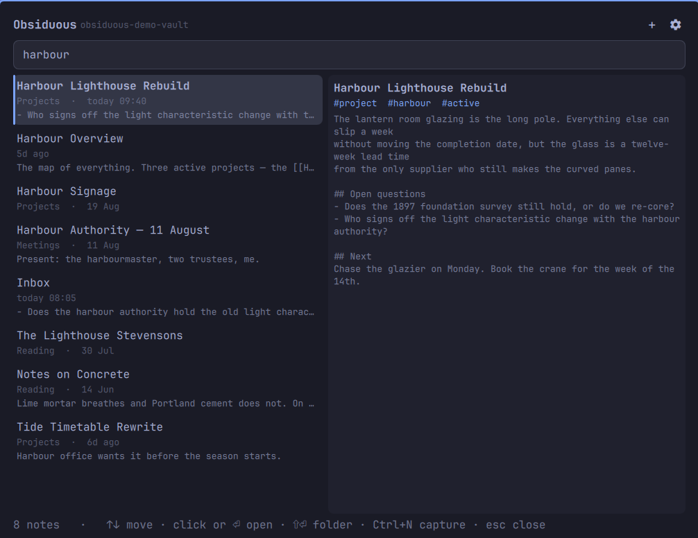

# Obsiduous

Your whole Obsidian vault, in the bar, answered from memory.

Obsiduous keeps your notes resident in RAM, so search answers every keystroke
instead of walking the filesystem again for each letter.



## What it does

- **Indexes the whole vault once**, in a single background process shared by
  every bar on every monitor, and refreshes only the notes that changed.
- **Ranks the way you meant it.** Exact matches in a title, then a path, then
  the body; a fuzzy subsequence match (`pfsnb` finds *pfSense Networking
  Bible*) is offered underneath, never above, a genuine hit.
- **Learns what you open.** Notes you return to rise in the ranking, with a
  30-day half-life so last month's obsession fades on its own.
- **Filters:** `tag:project`, `path:Journal`, `in:daily`, combined with text.
- **Previews the note beside the results**, so reading four lines does not mean
  starting Obsidian.
- **Captures a thought** into today's daily note, or as a new note. Both follow
  the vault's own Obsidian settings — the Daily Notes folder and date format,
  and the new-note location — rather than inventing a folder of their own.
- **Finds your vaults by itself**, from Obsidian's own configuration, including
  the registered vault name that `obsidian://` links need.
- **Switches vault from the search field.** Type `vault:` for the list, with
  note counts, and press Enter.

## Install

```sh
omarchy plugin add https://github.com/weedwhitesandwine/obsiduous.git --enable
```

Enabling it puts the icon in the bar. Move it to a section you prefer with:

```sh
omarchy bar move io.github.weedwhitesandwine.obsiduous --section right
```

## Using it

Click the bar icon (or press its hotkey) and start typing.

| Key | Does |
| --- | --- |
| `↑` `↓` | Move through results |
| `PgUp` `PgDn` | Move eight at a time |
| `Enter` | Open the selected note in Obsidian |
| `Shift+Enter` | Open the folder containing the note, in your file manager |
| `Esc` | Clear the query; again to close |
| `Ctrl+N` | Open the capture editor |
| `Tab` | Move to the next bar panel |
| Right click | Open the vault root in Obsidian |

Vaults are listed under the gear icon, read from Obsidian's own config. The
choice is remembered in `~/.local/state/omarchy/obsiduous/settings.json`.

## Query filters

| Filter | Example | Matches |
| --- | --- | --- |
| `tag:` | `tag:recipe` | Frontmatter `tags:` and inline `#tags` |
| `path:` | `path:Journal` | The note's path within the vault |
| `in:daily` | `in:daily standup` | Notes in the vault's daily-notes folder |
| `vault:` | `vault:work` | Switches vault — see below |

`tag:`, `path:` and `in:` combine with each other and with free text.

## Several vaults

One vault is indexed at a time, and switching between them happens in the
search field rather than in settings, because realising you are in the wrong
vault happens mid-search.

Type `vault:` to replace the results with the list of vaults Obsidian knows
about, each with its note count and the current one marked. Keep typing to
filter the list by name, press Enter to switch, or Escape to leave the
switcher. `vault:` has to start the query, so whatever you were searching for
is already gone by the time the list appears; Escape clears the field rather
than restoring it. The vault you switch to is indexed immediately — a vault of
a few thousand notes takes well under a second — and the field is left empty
ready for the new one.

A vault whose folder no longer exists is listed as `missing` and cannot be
selected. A vault set by hand, rather than through Obsidian, appears in the
list too.

Notes you open are ranked per vault, so returning to `Inbox.md` in one vault
does not push a differently-owned `Inbox.md` up the list in another.

## Capturing a note

`Ctrl+N`, or the `+` in the panel, opens a small editor with three buttons.

**Save as daily note** appends `- **HH:MM** what you typed` to today's daily
note, creating it if it does not exist yet, using the folder and date format
from the vault's own `.obsidian/daily-notes.json`.

**Save as note** writes a new Markdown file wherever Obsidian is configured to
put new notes — its `newFileLocation` setting, so the vault root for most
people, or the folder you nominated. It is named for the title you gave it, or
a timestamp if you gave none, and an existing file is never overwritten.

Appending is the normal case and leaves the file exactly as it was apart from
the line added at the end. When today's daily note does not exist yet,
Obsiduous creates it with a date heading and your line.

If you use a daily-note template, let Obsidian make the file — open today's
daily note there once, and capture into it afterwards. Obsiduous deliberately
does not run templates: a Templater template is arbitrary JavaScript, and a
plugin that executed half of one would hand you a file that looked right and
was not.

## A hotkey

Settings, under `HOTKEY`: click the field and press the combination you want —
one or more of `SUPER`, `CTRL`, `ALT`, `SHIFT` and one other key — then press
Bind. The field records what you press rather than asking you to spell it out.

Nothing is suggested for you, because any combination this plugin picked would
sooner or later be one you had already bound to something else. A combination
Hyprland already uses is intercepted before it reaches the panel, so nothing
appears when you press it — which is a reliable way of telling that a key is
taken. `hyprctl binds` lists them all.

The hotkey is written as a marked block in `~/.config/hypr/bindings.lua`:

```lua
-- >>> obsiduous hotkey (managed by Obsiduous settings — change it there)
-- If Obsiduous has been uninstalled these lines do nothing: delete them.
o.bind("SUPER + ALT + N", "Obsiduous", "omarchy-shell shell toggle io.github.weedwhitesandwine.obsiduous")
-- <<< obsiduous hotkey
```

Only that block is ever replaced or removed, and only when you press Bind or
Clear. If the two markers are not a matched pair — a hand edit, a merge
conflict in a dotfiles repository — the file is left exactly as it is and the
reason is printed, rather than guessing where the block ended.

A hotkey is modifiers plus one key. Anything else is refused rather than
escaped, both in the settings card and again in the script, because the value
ends up inside a Lua string. The same script can be run directly:

```sh
bash obsiduous-ctl.sh bind "SUPER + ALT + N"
bash obsiduous-ctl.sh unbind
```

## What it writes, and when

These are every path Obsiduous can write, and nothing else is touched. The
last two are only reachable by pressing a button in settings.

| Path | When | What |
| --- | --- | --- |
| `~/.local/state/omarchy/obsiduous/settings.json` | You change a setting | Vault path, bar glyph, preview toggle, hotkey |
| `~/.local/state/omarchy/obsiduous/opens.json` | You open a note | Per-note open count and timestamp, for ranking |
| `<vault>/<daily notes folder>/<date>.md` | You press "Save as daily note" | One appended `- **HH:MM** your text` line, creating the file if today's does not exist |
| `<Obsidian's new-note location>/<title>.md` | You press "Save as note" | The note you typed, named for its title — or a timestamp if you gave none |
| `~/.config/hypr/bindings.lua` | You press Bind or Clear under `HOTKEY` in settings | Only Obsiduous's own marked block, added, replaced or removed. Every other line is copied through unchanged |
| `~/.config/omarchy/shell.json` | `obsiduous-ctl.sh bar on\|off`, if you run it | Only Obsiduous's own `{"id": …}` entry, moved between the bar layout and the enabled-plugins list |

Every one of those writes works the same way: the destination directory is
checked to be yours and not group- or world-writable, a stage file is created
under a random name in that same directory — never a predictable one, which is
what a pre-planted symlink turns into the truncation of its target — and it is
renamed into place in a single step, so an interrupted write can never leave
half a file. `bindings.lua` and `shell.json` are resolved through any symlink
first, so a dotfiles repository keeps both its link and its content, and the
stage file is created beside the real file rather than across a filesystem.

Processes it runs:

| Command | Why |
| --- | --- |
| `setpriv --pdeathsig TERM python3 obsiduous-indexd.py <vault>` | The index daemon; the kernel kills it when the shell exits |
| `python3 -c <inline reader>` | Reads the settings file under a size ceiling |
| `mkdir -p -m 700 ~/.local/state/omarchy/obsiduous` | Creates its own state directory |
| `xdg-open obsidian://…` | Opens the selected note, when you press Enter |
| `xdg-open <vault>/<folder>` | Opens a note's folder, on Shift+Enter |
| `bash obsiduous-ctl.sh bind\|unbind` | Writes or removes the hotkey block, when you press Bind or Clear |
| `hyprctl reload` | Asks Hyprland to pick up the changed bindings, after that write |

The daemon reads the vault you selected — its Markdown, and its own
`.obsidian/daily-notes.json` for the daily-note folder and date format — plus
Obsidian's `obsidian.json` to list your vaults, its `.obsidian/app.json` for
where new notes belong, and its own `opens.json` back from the state
directory. The settings reader reads `settings.json`. The
control script reads `bindings.lua` and `shell.json` before rewriting its own
part of them. Every path it reads is named above and every process it starts
is in the table; all of them are on this machine.

## Reading limits

The daemon and the shell both live for days, so every value crossing into them
is bounded where it enters:

- Each note is read to a 512 KB ceiling; the whole in-memory corpus stops at
  96 MB and 20,000 notes, and the panel says when the index was truncated.
- Every file the daemon and the settings reader open uses
  `O_NOFOLLOW|O_NONBLOCK` and checks for a regular file on the descriptor
  before a byte is read, so a planted symlink is refused rather than followed
  and a named pipe cannot stall the process. `shell.json` is read the same way.
  `bindings.lua` is the exception by design: it is resolved with `realpath` and
  its target and directory checked to be yours and not group- or
  world-writable, because a dotfiles manager legitimately symlinks it.
- Replies from the daemon are measured before they are written, and again
  before the shell parses them.

## The index

The vault is read once into memory and kept there, which is what makes a
keystroke cost a millisecond rather than a filesystem walk. Keeping it current
is automatic: a stat walk runs every couple of seconds while the panel is open
and every thirty seconds when it is closed, notes that appear or disappear are
picked up, and a note is re-read whenever its timestamp or size has changed.

Settings shows how many notes are indexed, and a **Rebuild** button that
re-reads every note from disk. You should not normally need it. It exists for
one case the incremental scan cannot see: a note whose contents changed while
both its timestamp and its size stayed the same, which is what happens when a
file arrives from a sync tool that preserves timestamps.

## Requirements

- Omarchy with the Quickshell-based shell
- `python3`, `bash`, `setpriv` (util-linux) and coreutils, all already present
  on Omarchy
- `hyprctl`, only to apply a hotkey once you set one
- Obsidian, to open notes through `obsidian://` links
- A vault of Markdown files. Obsidian itself can be closed while you search.

## Update

```sh
omarchy plugin update io.github.weedwhitesandwine.obsiduous
```

## Remove

```sh
omarchy plugin remove io.github.weedwhitesandwine.obsiduous
```

If you bound a hotkey, take it out first. Removing a plugin deletes it and
runs nothing belonging to it, so the block would stay in your `bindings.lua`:

```sh
bash ~/.config/omarchy/plugins/io.github.weedwhitesandwine.obsiduous/obsiduous-ctl.sh unbind
```

A block left behind is inert — it toggles a plugin id that no longer resolves —
and it carries a line saying so, and saying to delete it, for anyone who finds
it later.

Your vault is untouched by removal. Notes captured into it are ordinary
Markdown files and stay where they are. To clear the plugin's own state:

```sh
rm -rf ~/.local/state/omarchy/obsiduous
```

## Development

```sh
omarchy plugin validate .
python3 -m py_compile obsiduous-indexd.py
```

The daemon speaks JSON lines on stdin and stdout and can be driven by hand:

```sh
echo '{"c":"search","id":1,"q":"tag:recipe"}' | python3 obsiduous-indexd.py ~/vault
```

## Licence

[MIT](LICENSE)

Built with [Claude Code](https://claude.com/claude-code).
